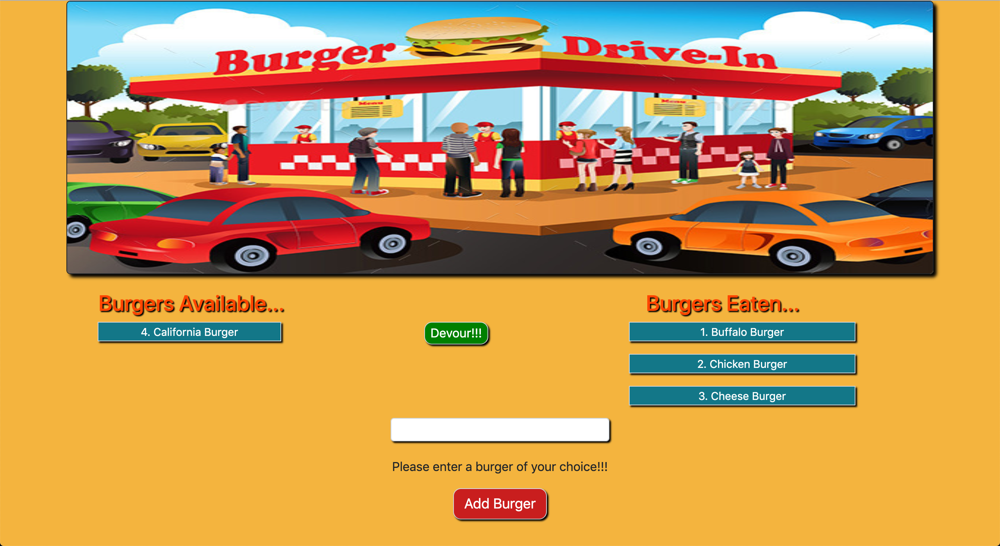

# Burger Restaurant App

### Description

This is an application which allows the user to enter a burger of their choice that they like to eat.
Whenever a user submits a burger's name, the burger will then be displayed on the left side of the page, waiting to be devoured. Once a burger has been devoured by clicking the `devour button`, the burger will then be displayed on the right side of the  page. 

### Heroku Link 

### Technologies used in building the application

* NodeJS
* MySQL
* ExpressJS
* ExpressHandlebars
* HTML, CSS, Javascript
* Heroku
* Git

___

___

### Instructions on how to use the application 

* Clone the respository
* Open `Schema.sql` and `seed.sql` files in `Mysql workbench` and then run it.
* Enter Mysql `password` in `connection.js` which is found in the `config` folder.
* Install all npm packages with `npm install`.
* Run the app with `node server.js` in the terminal to start the application.
* Open the local application on port 5000 at the URL: `http://localhost:5000/`.
